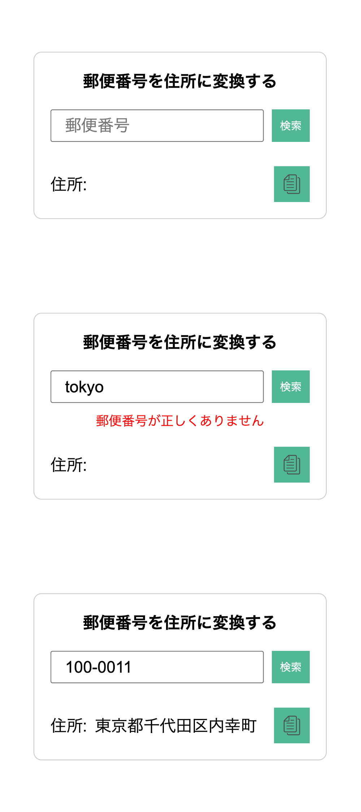

# 郵便番号を住所に変換するサイト

JavaScript の学習コンテンツで、HTML,CSS,JavaScript で実装しています。

- 郵便番号を正規表現でチェックする
- 非同期処理で郵便場号から住所を取得する
- 住所をクリップボードにコピーする

## 技術スタック

- 正規表現
- 非同期処理（fetch）と例外処理
- クリップボード（navigator.clipboard）

## 画面

